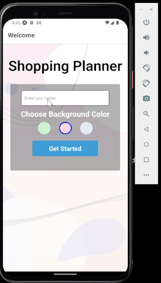

## Shopping Planner App

## Features

- Create and manage multiple shopping lists
- Mark items as completed as you shop
- Stay organized with user-friendly interface

### Technologies Used
- JavaScript
- React Native
- Firebase Firestore
- Firebase Authentication

### Development Environment Setup
To set up the development environment, follow these steps:

1. Clone the repository: `git clone https://github.com/torbalansky/shopping-list-app.git`
2. Install Node.js and npm: [Download Node.js](https://nodejs.org/)
3. Install project dependencies: `npm install`
4. Configure Firebase:
   - Go to [Firebase Console](https://firebase.google.com/) and create a new project.
   - Obtain Firebase configuration values (apiKey, authDomain, projectId, etc.).
   - Replace the configuration values in `src/config/firebase.js` with your own.
5. Start the app: `npm start`

### Database Configuration
The app uses Firebase Firestore for data storage. To configure Firestore:

1. Go to [Firebase Console](https://firebase.google.com/) and navigate to your project.
2. Click on "Firestore Database" from the left sidebar.
3. Click "Create Database" and set up Firestore in test mode.
4. Create a collection named "shoppinglists" to store shopping lists.

### Dependencies
"dependencies": {
    "@react-native-async-storage/async-storage": "^1.17.11",
    "firebase": "^9.22.0",
    "react": "18.2.0",
    "react-native": "0.71.7",
    "react-native-elements": "^3.4.2",
    "react-native-vector-icons": "^9.0.0"
}
